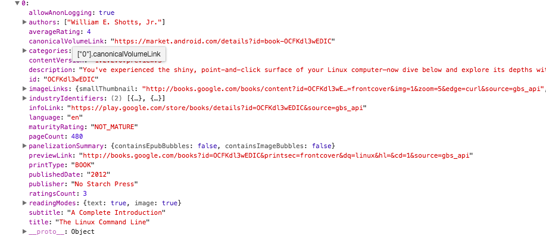
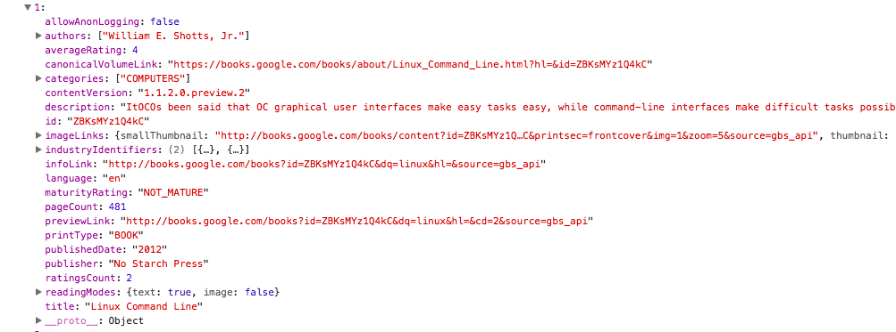

A book shelf react application for beginner.

How to install:
Git clone this project, and go into reactnd-project-myreads-starter folder,
type:
```
npm install
```

How to start:
type 
```
npm start
```

npm install --save react-router-dom

For the issue on 'Search duplicate results', please check the below screen shot and notice the id column, I find the same book can have different id. Can this be a bug in server API?



